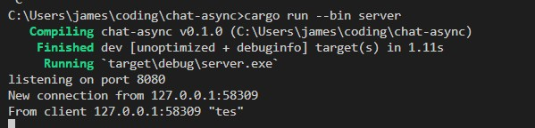
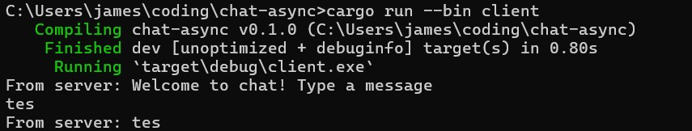
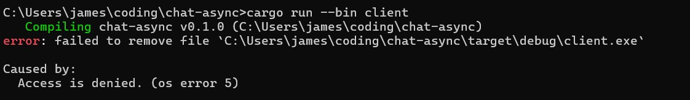
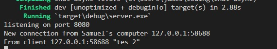
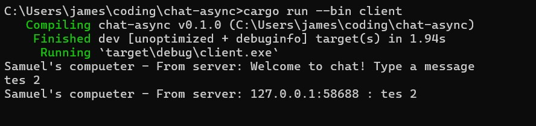

# Advance Programming Tutorial 10
Tutorial for Advanced Programming 2024 Module 10 - Faculty of Computer Science, Universitas Indonesia

---
Reflection - Broadcast Asynchronous Chat

---

*2.1. Original code of broadcast chat.*

Ketika server dijalankan, setiap kali client terhubung menggunakan WebSocket, mereka akan terhubung ke server. Gambar di atas menunjukkan bahwa ketika pengguna mengirim pesan dari salah satu client, pesan tersebut akan dikirim ke server, dan dari server akan diteruskan ke semua client yang terhubung ke server tersebut.

Dengan demikian, setiap pesan yang dikirim oleh satu client akan diterima oleh semua client lainnya. Ini mirip dengan sebuah ruang obrol di mana pesan yang dikirim oleh salah satu pengguna dapat dilihat secara real-time oleh pengguna lainnya. Kemampuan untuk mengirim dan menerima pesan secara real-time terjadi karena WebSocket memfasilitasi komunikasi instan antara server dan client tanpa perlu menunggu respons dari server.

*2.2. Modifying the websocket port*

port sama:

port beda:

Seperti yang dijelaskan dalam tutorial, koneksi antara client dan server merupakan hubungan dua arah, yang memerlukan modifikasi di kedua sisi jika terjadi perubahan. Dalam kasus ini, modifikasi dilakukan dengan mengubah port menjadi 8080 di bagian server.rs, yaitu TcpListener::bind("127.0.0.1:8080").await?, dan di client.rs, yaitu ws://127.0.0.1:2000. Dengan melakukan perubahan port di kedua sisi, koneksi antara client dan server dapat dipastikan berjalan dengan lancar tanpa adanya gangguan.

Sama-sama menggunakan protokol yang sama, yaitu WebSocket yang diimplementasikan melalui library tokio_websockets, untuk mendukung komunikasi real-time. Di server.rs, WebSocket dijelaskan menggunakan WebSocketStream dan ServerBuilder, sementara di client.rs, menggunakan ClientBuilder dan WebSocketStream.

*2.3. Small changes. Add some information to client*

1. Mengubah teks yang dikirimkan secara broadcast menjadi bcast_tx.send(format!("{addr} : {text}"))?;. Hal ini dilakukan untuk menyisipkan informasi IP dan Port dari pengirim ke dalam pesan.

2. Menambahkan nama pengirim pada server.rs di bagian New connection from Samuel's Computer {addr:?}. Ini dilakukan untuk memberikan informasi yang lebih lengkap tentang koneksi yang berasal dari komputer pengirim.
3. Menambahkan nama pengirim pada client.rs di bagian Samuel's Computer - From server: {}", text. Tujuannya adalah untuk mengetahui asal pesan dan mengidentifikasi sumber pesan, yaitu komputer pengirim.

Dengan melakukan perubahan ini, pesan yang dikirimkan akan mencakup informasi yang lebih lengkap tentang pengirim, termasuk IP dan Port-nya, serta memberikan pemahaman yang lebih baik tentang sumber pesan pada sisi server dan client.
