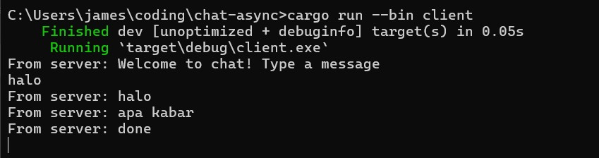

# Advance Programming Tutorial 10
Tutorial for Advanced Programming 2024 Module 10 - Faculty of Computer Science, Universitas Indonesia

---
Reflection - Broadcast Asynchronous Chat

---

2.1. Original code of broadcast chat.

Ketika server dijalankan, setiap kali client terhubung menggunakan WebSocket, mereka akan terhubung ke server. Gambar di atas menunjukkan bahwa ketika pengguna mengirim pesan dari salah satu client, pesan tersebut akan dikirim ke server, dan dari server akan diteruskan ke semua client yang terhubung ke server tersebut.

Dengan demikian, setiap pesan yang dikirim oleh satu client akan diterima oleh semua client lainnya. Ini mirip dengan sebuah ruang obrol di mana pesan yang dikirim oleh salah satu pengguna dapat dilihat secara real-time oleh pengguna lainnya. Kemampuan untuk mengirim dan menerima pesan secara real-time terjadi karena WebSocket memfasilitasi komunikasi instan antara server dan client tanpa perlu menunggu respons dari server.